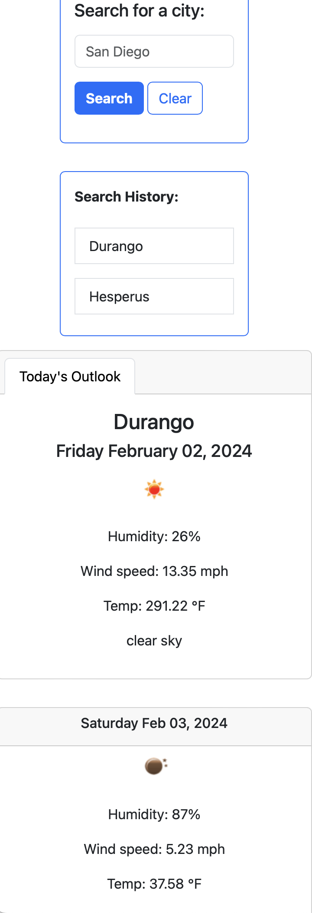

# Weather Dashboard

<!-- TABLE OF CONTENTS -->

  
Table of Contents

  <ol>
    <li>
      <a href="#about-the-project">About The Project</a>
      <ul>
        <li><a href="#built-with">Built With</a></li>
      </ul>
    </li>
    <li><a href="#usage">Usage</a></li>
    <li><a href="#contributing">Contributing</a></li>
    <li><a href="#license">License</a></li>
    <li><a href="#contact">Contact</a></li>
    <li><a href="#acknowledgments">Acknowledgements</a></li>
  </ol>

<!-- ABOUT THE PROJECT -->
## About The Project

### User Story:

    AS A traveler
    I WANT to see the weather outlook for multiple cities
    SO THAT I can plan a trip accordingly

This is what you can expect to see upon opening the page:

This page is responsive, so it will look good using any device!

(<a href="#readme-top">back to top</a>)

### Built With

* Javascript
* HTML
* CSS
* Bootstrap CSS
* JQuery
* DayJS
* OpenWeather API

(<a href="#readme-top">back to top</a>)

<!-- USAGE EXAMPLES -->
## Usage

This section outlines each step in this simple and easy-to-navigate-through Weather Dashboard upon visiting the website.

> Simply click "Clear" if you'd like to reset your search history!

> Your previous searches will save for easy future viewing - access them again with the click of a button!

(<a href="#readme-top">back to top</a>)

<!-- CONTRIBUTING -->
## Contributing

Contributions are what make the open source community such an amazing place to learn, inspire, and create. Any contributions you make are **greatly appreciated**!

_If you have a suggestion that would make this better, please fork the repo and create a pull request. You can also simply open an issue with the tag "enhancement".
Don't forget to give the project a star! Thanks again!_

1. Fork the Project
2. Create your Feature Branch (`git checkout -b feature/NewFeature`)
3. Commit your Changes (`git commit -m 'Added ______ , NewFeature'`)
4. Push to the Branch (`git push origin feature/NewFeature`)
5. Open a Pull Request

(<a href="#readme-top">back to top</a>)

<!-- LICENSE -->
## License

Distributed under the MIT License. See `LICENSE.txt` for more information.

(<a href="#readme-top">back to top</a>)

<!-- CONTACT -->
## Contact

**Rebecca Feltman** - [Email me](mailto:beckpull@icloud.com) - or check me out on [GitHub!](https://github.com/beckpull) 

>Project Link: [https://github.com/beckpull/weather-dashboard](https://github.com/beckpull/weather-dashboard)
>
>Deployed Page: [https://beckpull.github.io/weather-dashboard/](https://beckpull.github.io/weather-dashboard/)

(<a href="#readme-top">back to top</a>)

<!-- ACKNOWLEDGMENTS -->
## Acknowledgments

* This README file was created using the template found at: https://github.com/othneildrew/Best-README-Template

#### Disclaimer: 
> I utilized several Javascript articles from sources such as (but not limited to) Stack Overflow, W3Schools, and MDN Web Docs **as references** for the javascript code attached. 
>
>**All of the utilized information has been altered in order to fit this project.** 

(<a href="#readme-top">back to top</a>)
